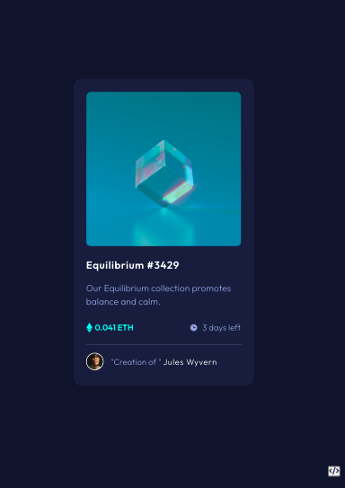

# Frontend Mentor - NFT preview card component solution

This is a solution to the [NFT preview card component challenge on Frontend Mentor](https://www.frontendmentor.io/challenges/nft-preview-card-component-SbdUL_w0U). Frontend Mentor challenges help you improve your coding skills by building realistic projects. 

## Table of contents

- [Overview](#overview)
  - [The challenge](#the-challenge)
  - [Screenshot](#screenshot)
  - [Built with](#built-with)
  - [What I learned](#what-i-learned)
  - [Useful resources](#useful-resources)
- [Author](#author) b

**Note: Delete this note and update the table of contents based on what sections you keep.**

## Overview
- Challenge rontend mentor to build an NFT card.
### The challenge

Users should be able to:

- View the optimal layout depending on their device's screen size
- See hover states for interactive elements

### Screenshot




### Built with

- Semantic HTML5 markup
- CSS custom properties
- Flexbox
- Vanilla Javascript
- [Styled Components](https://fontawesome.com/) - For styles


### What I learned

- This section goes over what i learnt while building this project.
- Here are the key highlights that am very proud of.

```html
<h1>My learnings</h1>
```
```css
.proud-of-this-css {
  color: papayawhip;
  box-shadow : box-shadow: 0 3rem 2rem -1.5rem var(--bg-color-secondary),
      0 1.5rem 1.5rem 3rem var(--bg-color-secondary);
      /**positioning **/
  position: relative;
  position: absolute;
}
```
```js
const proudOfThisFunc = () => {
  console.log('Yaay, High Order functions🎉')
}
```

### Useful resources

- [Frontend Masters](https://frontendmasters.com/) - This helped me for learn Javascript fundamentals. I really liked the way the teach and you should try it out.
- [CSS Tricks](https://css-tricks.com/) - This is an amazing site which helped me finally understand the various CSS properties. I'd recommend it to anyone still learning this concept.

## Author

- Github - [Lentumunai](https://www.github.com/geez-god)
- Twitter - [@loshilumark](https://www.twitter.com/loshilumark)

